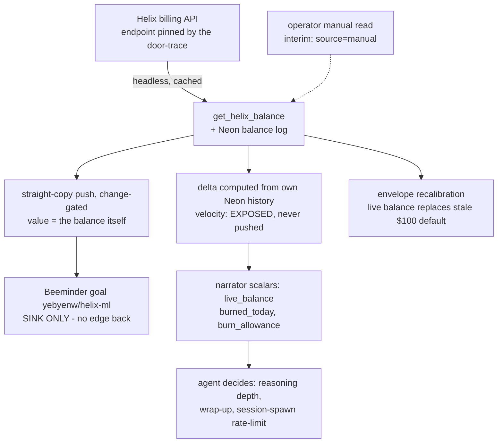

# How Mecris Works

*A field guide to the whole machine — the sensors, the pumps, the governors, and the money.*

> Generated 2026-09-19 by `agent/qwen3.8-flash-next` (Helix Bunker) — authorship confirmed by
> the operator, superseding the founding brief's "Opus 5" alias. Planning deliverable for
> SpecTask 588, **rev 4** (revs 2–3 after operator Spec-Review; rev 4 dated 2026-09-21 after an
> external review round). **Pinned to commit `8a42915`**: every `file:line` claim below refers
> to that tree; changes since this rev are documentation-only. Dated facts (balances, dates,
> goal parameters) are point-in-time as marked; their *maintained* copies live in
> `helix-specs/design/tasks/000588_the-mecris-repo-has-some/` — task-specific acceptance tests
> and the decision log deliberately live there, not here. §§1–5 describe the machine and age
> slowly; §§6–10 apply the lens to the money subsystem and age faster — the date-stamps are the
> warranty. Every claim is grounded in the code and documents cited in the
> [Source Map](#appendix-a-source-map). Where the code contradicts a common telling of the
> story, the code wins, and the discrepancy is called out in
> [Corrections and Open Questions](#corrections-and-open-questions).

---

## 1. What Mecris is

Mecris is not an acronym. It comes from the Greek *makri* (μακριά) — "far, at a long distance" —
and the name means **long life, and going far**. The whole system exists to give one human being
a very long planning horizon and to keep them walking toward it.

Concretely, that human wanted three things to make the macro experience complete:

1. **Study Arabic** (Clozemaster reviews pile up; the pile must go down),
2. **Study Greek** (an odometer of points must go up),
3. **Go for a walk** (miles, every day, against the `bike` goal).

Everything else in the repo — the MCP server, the Android app, the WASM edge, the nag ladder, the
SMS loop, the schedulers, the four budget governors — is the Rube Goldberg connectivity required
to *remind* that human to do those three things and to make it easy to see what is good for them.
Mecris corrals the data sources (Clozemaster, Health Connect, Chrome bookmarks, Twilio, Helix,
Groq, Anthropic, Gemini, OpenRouter) and funnels all of it into **Beeminder**, whose threat of a
real-money charge is the load-bearing wall of the entire philosophy: *it was your goal after all.*

If you want the mythology (the Diseased Forest, the Iron Heart, the Standard of Bone), it lives in
`ARCHITECTURE.md`. This article is the engineering translation of the same map.

The one-sentence version, from the durable memory bundle
(`knowledge/architecture/overview.md`): Mecris is a *personal accountability system centered on a
Python MCP integration layer, user-scoped Neon state, Android/edge clients, and an auditable
agent loop.*

---

## 2. Anatomy of the machine

```text
                               ┌─────────────────┐
                               │   NEON DB       │   the forest floor: one Postgres,
                               │ (Central State) │   every table scoped by user_id
                               └─┬─────────────┬─┘
                  (Cloud Path)   │             │   (Local Path)
                ┌────────────────┴──────┐      ▼────────────────┐
                │   CLOUD EDGE          │      │   LOCAL MCP     │  PRIMARY brain.
                │   Akamai *fwf.app     │      │ (Python / SQL)  │  FastAPI + FastMCP +
                │   ACTIVE, "marginal   │      │  mcp_server.py  │  APScheduler (leader-
                │   failover" (spin aka │      │  scheduler.py   │  elected jobs)
                │   cron: reminders 2h, │      └──────┬─────────┘
                │   failover-sync daily)│             │
                └───────────┬───────────┘             │   Fermyon Cloud: deprovisioned
                            │                         │   (June 2026 "Cloud Easing",
                            │                         │    reversible — knowledge/
                            │                         │    decisions/2026-06-cloud-easing.md)
           ┌────────────────┴─────────────────────────┴──────────────┐
           │              THE STANDARD BUS (JSON / WIT)              │
           └────┬───────────────┬─────────────────┬─────────────┬────┘
                ▼               ▼                 ▼             ▼
         ┌────────────┐  ┌─────────────┐  ┌───────────────┐  ┌─────────────┐
         │  MECRIS-GO │  │ AGENT HARNESSES│ HUMAN / CLI   │  │ CI TRIGGERS │
         │  (sensors) │  │ Pi, Claude…   │  │ (bin/mecris) │  │ (GHA/hooks) │
         └────────────┘  └─────────────┘  └───────────────┘  └─────────────┘
```

### The parts, plainly

| Part | Where it lives | What it actually is |
|---|---|---|
| **Neon DB** | hosted Postgres | The only truth. Tables: `users`, `token_bank`, `walk_inferences`, `language_stats`, `goals`, `message_log`, `usage_sessions`, `autonomous_turns`, `budget_tracking`, `budget_governor_spend_log`, `scheduler_election` (`knowledge/architecture/data/neon-db.md`) |
| **Local MCP** | `mcp_server.py`, `scheduler.py` | The primary interactive backend since the June 2026 Cloud Easing. ~40 MCP tools registered; the Pi bridge activates only `get_narrator_context` + `mecris_load_tools` at startup and lazy-loads capabilities (`knowledge/decisions/2026-09-06-deterministic-status.md`) |
| **Cloud edge** | `mecris-go-spin/sync-service/src/lib.rs` (748 lines of Rust on Spin) | Deployed to **Akamai Functions** (`*.fwf.app`) via `deploy-akamai.sh`. Live but explicitly "MARGINAL (FAILOVER ONLY)" (`docs/AKAMAI_CRON_EVALUATION.md`). Runs the Clozemaster scraper failover, SMS reminders, heartbeats |
| **Android app** | `mecris-go-project/` | Kotlin/Compose, v0.0.3 (versionCode 34). NOT a submodule stub — real code. "Mecris-go" means "Mecris **on the go**", not the language |
| **The bus** | JSON at every boundary; WIT contracts per WASM component | The repo-level `wit/empty.wit` is literally empty; WIT lives per component (`wit/review-pump.wit` etc.) |
| **Harnesses** | Pi (official), Claude Code, Antigravity, py_harness/Ollama | Each has different token-efficiency tradeoffs (`README.md` harness table) |

Two scheduling systems coexist and coordinate through `scheduler_election` heartbeats: the local
APScheduler jobs (reminder check with 3–25 min fuzz, language sync, walk sync, 15-min archivist)
run on the elected leader; the cloud stands down when it sees a fresh `leader` heartbeat. Akamai
platform cron (`spin aka cron list`) fires `trigger-reminders` every 2h and `failover-sync` daily,
because the Spin manifest's own `[[trigger.cron]]` is commented out and **no GitHub Action does
cloud cron** (`spin.toml:54-58`, `docs/AKAMAI_CRON_EVALUATION.md:11-14`).

The ghost archivist (`knowledge/architecture/ghost-heartbeat-restoration.md`) is a "reality
enforcer" heartbeat; when `NEON_DB_URL` was removed for multi-tenancy work it silently lost its
heartbeat for ~404.6 hours until PR #297 moved it to a POST `/heartbeat` path. That story is the
system in miniature: every organ must have an observable pulse.

---

## 3. Identity: how you prove who you are — and what it really unlocks

The common telling is: *"the Android app's OIDC token enables the API service to decrypt the
user's data."* The honest architecture is different in an important way, and the difference
matters for the budget work ahead, so it's stated precisely.

**The IdP is self-hosted Pocket ID** (`https://metnoom.urmanac.com`, LAN/Tailscale), not Google.
There is no Google ID token anywhere in the repo (zero grep hits). The Android app logs in with
OIDC Authorization Code + **passkeys (WebAuthn)** through AppAuth, scopes
`openid profile email offline_access`, storing tokens in hardware-backed
`EncryptedSharedPreferences` (AES256-GCM master key) (`PocketIdAuthRepository.kt:136-147, 208-241`).
Access tokens last 1 hour; refresh tokens 30 days ("submarine mode" — the phone can disappear
offline for a month), with sliding-window refresh at 80% TTL (`PocketIdAuthRepository.kt:383-446`).
The CLI (`bin/mecris login`) uses the same flow with explicit PKCE S256; the Android PKCE/nonce
audit is still open (`docs/SECURITY_ROADMAP.md:34-38`).

**Validation.** The Rust edge (`extract_user_id`, `sync-service/src/lib.rs:641-672`) verifies the
JWT signature against a JWKS that was **fetched once at deploy time and frozen into
`deploy-akamai.sh:64`**; it skips `iss`/`aud`/`exp` checks and has an `auth_bypass` debug path.
The missing JWKS variable caused a **64-day silent 401 outage** (`blog/2026-07-30-the-missing-variable.md`).
The Python side runs `MECRIS_MODE=standalone` (default) which decodes tokens **without signature
verification** (`cli/main.py:63-69, 161-165`) — acceptable on your own laptop, and the same
endpoint code ships everywhere. These two facts are tracked as findings **S2/S3** in
[Corrections and Open Questions](#corrections-and-open-questions).

**Identity mapping is trivially clean:** the JWT `sub` is literally the primary key
`users.pocket_id_sub` (`schema.sql:5`); user rows auto-create on first `/walks` POST.

**And here is the correction:** OIDC proves *who you are to the API*; it does **not**
cryptographically unlock your third-party credentials. There is no per-user key and no key
wrapping. One global **master key** (an `openssl rand -hex 32` generated once into 1Password,
"Dark-Pipe" style — `docs/BOOTSTRAP_KEY_MANAGEMENT.md:21-23`) is provisioned as the Spin variable
`master_encryption_key` and into local `.env`. At request time the API service decrypts your
Clozemaster email/password, Beeminder token, phone number, and even the Twilio auth token
(encrypted at rest in Neon as AES-256-GCM blobs, format `hex(nonce[12] ‖ ciphertext‖tag)`,
identical in Rust `lib.rs:620-639` and Python `services/encryption_service.py`). The trust model
is *deliberately trusted cloud*: the operator's key, not the user's key, does the decrypting.
`docs/DATA_ARCHITECTURE_AND_PRIVACY.md:29-30` says the quiet part plainly: master-key compromise
exposes all tenants' PII. True end-to-end encryption (backend sees metadata only) is roadmap
step 10 (`docs/SECURITY_ROADMAP.md`).

So: **OIDC gate → operator master key → decrypted credentials → provider scraping/pushing.**
Both links are needed, and only the first one is per-user.

---

## 4. Sensors and loops: how the physical world reaches Beeminder

All Beeminder writes go to one endpoint family,
`POST https://www.beeminder.com/api/v1/users/{user}/goals/{slug}/datapoints.json`, form-encoded
with `auth_token`, `value`, `comment`, and — critically — **`requestid` for idempotency**
(`beeminder_client.py:290-319`; Rust twin `push_to_beeminder_idempotent`,
`sync-service/src/lib.rs:584-594`, which treats HTTP 422 as success because 422 means the
requestid dedupe fired).

### The Clozemaster loop (the funnel's mouth)

Clozemaster has no official API, so Mecris logs in as a human: GET `/login` for the CSRF token,
form login with a Chrome user-agent, scrape the `data-react-props` JSON off `/dashboard` to read
`numReadyForReview` (the pile), then hit the private `/api/v1/lp/{id}/more-stats` for the
forecast: tomorrow's due count and the 7-day liability (`scripts/clozemaster_scraper.py:162-259`).
The cloud failover runs the identical routine in Rust (`lib.rs:487-569`).

The stack snapshot is pushed as **today's datapoint** on the `reviewstack` goal with
`requestid = "{slug}-{YYYY-MM-DD}"` (US/Eastern) so retried syncs *rewrite* today's reading
instead of duplicating it (`clozemaster_scraper.py:332-348`). Results are cached in Neon
`language_stats` along with the goal's `safebuf`/`rate`/`derail_risk` read back fresh from
Beeminder (`services/language_sync_service.py:38-136`).

### The walk loop

The Android app reads **Health Connect** (Google's on-device health store; "Google Fit" reaches
the app only as a Health Connect data source, with per-`DataOrigin` filtering —
`HealthConnectManager.kt:155-179`). A `WalkHeuristicsWorker` runs every 15 minutes and posts
*coordinate-free summaries* (steps, meters, duration, and a route **point count** — never the
coordinates themselves) to `POST /walks`. The edge upserts `walk_inferences` and pushes `miles`
to the user's `beeminder_goal` (default `bike`) when the day's delta exceeds 200 m
(`sync-service/src/lib.rs:343-363`). Raw GPS never leaves the phone — this is the one privacy
claim that fully survives code inspection (the docs' claim that routes are kept *in* Encrypted
Shared Preferences is aspirational; in code they are simply never retained).

Note one real-world wrinkle worth fixing: the local scheduler deliberately uses a daystamp-only
requestid "so Beeminder overwrites the day's total instead of summing snapshots"
(`scheduler.py:99-120`), while the Rust path embeds `distance_meters` in the requestid — so on
the cloud path successive larger snapshots would each be new datapoints. Depending on the `bike`
goal's aggregation, that is a double-count waiting to happen — the same bug family as the March
`ellinika` corruption. Tracked as **W1** in [Corrections and Open Questions](#corrections-and-open-questions).

### The SMS loop (the nag ladder)

`/internal/trigger-reminders` (guarded only by the literal key `test-internal-key` — a known
gap) decrypts phone numbers and applies `should_dispatch`: local hour 9–20, steps < 2000,
≥120 min since last message, and deference to any Android heartbeat < 240 min old (the phone
nagged first, so the cloud shuts up). Texts say *"...Reply YES to log 1 mile."* An incoming
"YES" is matched to a user by decrypting every stored phone number (and, a security finding:
without validating `X-Twilio-Signature`), then pushes a 1.0-mile datapoint
(`sync-service/src/lib.rs:365-392, 450-472`). Reminder tiers escalate: Tier 1 → Tier 2 after 6h
idle → "IGNORED Nx" after 3 skips (`services/reminder_service.py`), and Arabic nudges inject the
pump's remaining-card count into the message template (`reminder_service.py:213-242`). The
literal-key guard and the missing webhook signature are tracked as findings **S1/S4** in
[Corrections and Open Questions](#corrections-and-open-questions).

The phone also has a **Sovereign Brain**: Gemini Nano via AICore runs on-device to generate nag
narratives that never leave the hardware (`ai/SovereignBrain.kt`).

---

## 5. The funnel: the Review Pump, and its dials

The mechanism the operator experiences as "the funnel that tells me I owe 72 Arabic cards today"
is called the **Review Pump** in the code ("funnel" appears exactly once in the repo, and in a
different context). The metaphor is hydraulic: debt, liability, levers, and three flow states —
*cavitation* (starved), *laminar* (steady), *turbulent* (ahead of schedule).

### The formula

Canonical implementation, `services/review_pump_core.py:56-64`:

```python
target_flow_rate = max( tomorrow_liability + floor(current_debt / clearance_days(multiplier)),
                        min_target )          # min_target: Greek=100 points, Arabic=0
```

The **lever** (`pump_multiplier`, stored per-language in `language_stats.pump_multiplier`, set via
MCP tool `set_review_pump_lever`) chooses how many days you give yourself to clear the pile:

| lever | name | days to clear the pile |
|---|---|---|
| 1.0 | Maintenance | none — target is just tomorrow's liability |
| 2.0 | Steady | 14 |
| 3.0 | Brisk | 10 |
| 4.0 | Aggressive | 7 |
| 5.0 | High Pressure | 5 |
| 6.0 | Very High | 3 |
| 7.0 | The Blitz | 2 |
| 10.0 | System Overdrive | 1 |

And the formula's shape is the whole design in one line:

> **required velocity = next-period liability + position ÷ horizon, floored at baseline.**

### Position and velocity — the dials

Six signals decompose cleanly (this decomposition is exactly what the budget governor wants to
copy, so it's inventoried precisely):

| Dial | Kind | Source |
|---|---|---|
| `current_debt` — the stack *now* | position | `numReadyForReview` scrape |
| `tomorrow_liability` — stack *tomorrow* if nothing happens | future position | `reviewForecast[0]` |
| `next_7_days` — summed liability | future position | `more-stats` scrape (Greek backlog boost fires ≥300) |
| `safebuf` — runway in *days* against Beeminder's road | position, in day-units | Beeminder goal read (`beeminder_client.py:376-396`); negative ⇒ deficit, merged as `effective_target = max(pump_target, -safebuf)` (`sync-service/src/lib.rs:311-321`) |
| `daily_completions` — cards actually done today | velocity | `ttmNumPlayedByDate.numPlayed`, with Eastern day-boundary reset |
| goal `rate`/`runits` — velocity the road *requires* | required velocity | Beeminder goal read |

Derived diagnostics: `debt_coverage_ratio` (velocity ÷ position), `flow_fill_ratio` (velocity ÷
required velocity), `is_play_mode` (debt > target×7 ⇒ a week-plus of backlog ⇒ play extra),
`beckon_signal` (debt ≥ 300 ⇒ *create a Beeminder goal* — the machine telling you to sign up for
more accountability; `review_pump_core.py:81-110`). Flow states classify velocity against two
reference rates: below tomorrow's liability is **cavitation**; at or above the target is
**turbulent**; between is **laminar** (`:113-127`).

### One formula, four bodies (the Zero-Split-Brain axiom)

Spec `specs/001-review-pump-core` demands byte-identical math everywhere, so the same formula
ships as: Python core (`services/review_pump_core.py`, stdlib only), Rust WASM live on the edge
(`mecris-go-spin/review-pump/src/lib.rs`, multipliers as integer tenths to dodge float-key
hazards), Kotlin on Android (`ReviewPumpCore.kt`, a 1:1 mirror), and a commented-out Python WASM
PoC. Two divergences to know: an older Extism engine in `review-pump-rs/` implements a different
*percentage* model (`base + ceil(backlog × (lever−1) × 0.10)`) and no host loads it; and the
spec's own `spec.md`/`plan.md` files are content-swapped. The wire protocol subtlety: Android's
"REMAINING TODAY" is *remaining* (`target_flow_rate = (effective_target − done).max(0)`), while
`absolute_target` is the quota.

### The safety valve, and why "do less" ≠ "do more"

Two Clozemaster goals, two species:

| | `reviewstack` (Arabic) | `ellinika` (Greek) |
|---|---|---|
| semantics | **stack size**, ~2k cards, "number go down" | **cumulative points**, ~26k, odometer |
| Mecris pushes it? | **yes** — daily snapshot, idempotent | **never** (`push_to_beeminder: False`) |
| progress looks like | a *smaller* pushed number | a *larger* pushed number |

In March 2026 both the Python and Rust paths pushed stack snapshots onto the odometer `ellinika`,
cratering a 26k-point graph and triggering a false Beemergency
(`docs/postmortems/2026-03-31-greek-data-corruption.md`, pattern `PM-CM-001`). The fix, spec 003
"The Safety Valve", is a WASM validator gating every push: odometer pushes may never regress or
zero-delta; backlog snapshots may always decrease; **unknown goal types fail closed**
(`mecris-go-spin/goal-type-rs/src/lib.rs:38-48`). Status: implemented and tested **standalone** —
but *not wired* into `BeeminderClient`; today's protection is still hardcoded maps. This is the
first latent arm to operationalize, because the budget goal proposed below is exactly the kind
of new goal that needs the valve.

---

## 6. The Budget Governor: the machine's own odometer

Why this subsystem exists at all is best told by its scar tissue: **the $247 drain**
(`docs/attic/archive/POSTMORTEM_BUDGET_SPIKE.md`). Between 2026-03-27 and 2026-05-02 the
`mecris-bot` — 200-turn limit, 8×-daily cron, TDG skill, `pytest -v` ingesting 1000+ test lines,
327KB `session_log.md`, newly-injected Chrome bookmarks — ate a $247 budget in five days. The
post-mortem's lesson is the governor's founding law:

> **Unmetered autonomy is an open checkbook.** If an agent has a loop, a high turn limit, and
> verbose tools, it will spend your money exponentially unless explicitly gated by a hard budget
> constraint.

The operator's lived experience matches: *"we've accidentally blown through $200+ in a couple of
days once in the history of Mecris; we do not want to do that again."*

### Four governors, not one

There are literally four implementations, and knowing which one runs is half the battle:

| Governor | Path | Backend | Polarity | Status |
|---|---|---|---|---|
| Legacy `BudgetGovernor` | `services/budget_governor.py:49-396` | JSON file (never exists) | max-rate (anti-binge) | deprecated; tests only |
| **`NeonBudgetGovernor`** | `services/budget_governor.py:403-751` | Neon `budget_governor_spend_log` | max-rate | **THE LIVE ONE** — instantiated `mcp_server.py:1621`, all 8 MCP tools route here |
| WASM component | `poc/wasm/budget-governor-py/app.py` | Spin KV | max-rate | **dead path** — Fermyon deprovisioned, no spin.toml, yet `get_budget_governor_status` still tries its URL first and silently falls back (`mcp_server.py:1629`) |
| Rust `mecris-budget-governor` | `mecris-core/src/budget/` (~1100 lines) | SQLite ledger | **min-rate (anti-waste)** — *spend credits before they expire* | fully coded binary, 13 passing tests, **zero wiring**: no CI, Makefile, or deploy references |

The last row matters — and the split is *by design*, not an oversight. Python governor =
**anti-binge**, and it runs **in-session**: its job is to be a truthful meter of what today's
spend has actually been — in aggregate, across everyone who shares the dollar — so a
card-counting agent (budget the session up front, re-triangulate when felt spend nears the
soft cap) can check real numbers instead of guessing from felt duration. Rust governor =
**anti-waste** (`is_due_for_soak = is_expiring ∧ spend_fraction < 0.05 ∧
period_elapsed_fraction < 0.05`, `expiry_policy.rs:64-80`), and it belongs **in the cloud,
where the Android app can call it**: the app spends no paid inference (the Sovereign Brain is
on-device AICore, §4), so its prompts are free and the governor's money-job there is noticing
credits going stale and feeding the *gentle* persistent nudge — "keep at it," never alarming.
Alarm discipline belongs to Beeminder alone: it is the only organ that says *"you are
derailing"*; Mecris prods, Beeminder bills ("it was your goal after all"). The two governors
share the "5/5" name and opposite souls, which is the point: the cool-cousin invariant
(*always have $500, always pick up the phone*) needs both bounds, and each bound lives next to
the organ that must enforce it. And the datapoint is the datapoint: whichever governor reads it,
the only duty is to write it faithfully through to the sink (§8).

### Buckets, and the Helix Inversion

| Bucket | Type | Default limit | Env var |
|---|---|---|---|
| `helix` | **SPEND** | $100.00 | `HELIX_CREDIT_LIMIT` |
| `gemini` | **SPEND** | $50.00 | `GEMINI_FREE_LIMIT` |
| `anthropic_api` | GUARD | $20.89 | `ANTHROPIC_BUDGET_LIMIT` |
| `groq` | GUARD | $10.00 | `GROQ_BUDGET_LIMIT` |
| `openrouter` | GUARD | $10.00 | `OPENROUTER_DOLLAR_LIMIT` |
| `openrouter_requests` | GUARD | 1000 | `OPENROUTER_REQUEST_LIMIT` |

`BucketType` (`budget_governor.py:39-40`): GUARD = ration real money; **SPEND = use-it-or-lose-it
credits — spend them on purpose** ("the Helix Inversion": prefer Helix/Gemini first, so paid
dollars are the last resort). Routing picks non-exhausted SPEND by *max remaining* (Python) —
the dead WASM variant picked by *min ratio*, an undocumented divergence. The spec's `copilot_work`/
`copilot_cncf`/`gemini_personal` buckets were never implemented; code added `openrouter` in their
place. Note the defaults are **era-stale**: they encode the $20.89-anthropic / $100-helix world,
not the current one (see §7). The live posture drifts further still: the Groq arm (bucket
default $10 GUARD) has been dialed back to *pennies a month* — Groq is priced near-free (they
won't bill you unless you insist), it doesn't offer the large context windows Helix's
subscription services do, and Mecris keeps it now for a single job: cleaning up transcripts
downstream of on-device streaming ASR (local Parakeet; the Whisper API is retired). Folding
such arms into the aggregate `budget` API is a tempting consolidation — and the operator's
reuse posture (§10 item 3) says try the existing surface before building a duplicate arm —
but the discipline is one tank at a time: the current task is **Helix only**.

### Envelope and gate, precisely

- `check_envelope(bucket, cost)` → `deny` if all-time spend ≥ limit; `defer` if the rolling
  39-minute window (`_DAYLIGHT_MINUTES=780 × 5%`) plus the estimate exceeds 5% of the bucket;
  else `allow` (`budget_governor.py:542-566`).
- `budget_gate(bucket, cost)` → `None` (proceed) or a dict; **only `deny` blocks** — `defer` is a
  warning. Wired pre-flight into `record_usage_session` / `record_claude_code_usage`
  (`mcp_server.py:940-964`) and guards on `get_real_anthropic_usage`, `trigger_language_sync`,
  `get_coaching_insight` — but with a fixed `cost=0.01` estimate, so in practice the pre-flight
  asks "is the bucket 100% exhausted?", not "can this turn afford itself?"
- The narrator context embeds `{routing_recommendation, envelope_status}`
  (`mcp_server.py:886`) so any agent can consult the governor per turn — *this* is the hook that
  makes "query the budget within a turn to decide how much reasoning to do" real.

### The money systems that are *not* the governor

Three separate checkbooks exist, with real drift between them:
`UsageTracker` (`usage_tracker.py`) is the wired checkbook (Neon `budget_tracking` row, seeds
`$24.96 / 2025-08-06→2025-09-30`, burn rate = 7-day spend ÷ 7, alerts at <$5 / >$2/day);
`VirtualBudgetManager` (daily $2 / monthly $60 allocation with emergency reserve) and
`BillingReconciliation` (Anthropic Admin API / Groq scrapers vs estimates) are **instantiated in
`mcp_server.py:568-570` and never called** — dead code paths with passing tests. The Groq
odometer (`groq_odometer_tracker.py`) *is* live and is the repo's only working **odometer
pattern**: poll a monotonically-climbing provider reading, detect monthly resets, derive daily
delta = today's cumulative − yesterday's cumulative. Remember this pattern; §7 builds on it.

### The Helix balance today, exactly

`NeonBudgetGovernor.get_helix_balance()` (`budget_governor.py:716-751`) does exist: it reads
`ANTHROPIC_BASE_URL` + `ANTHROPIC_API_KEY`, issues `GET {base}/api/v1/me` (Bearer auth, 5 s
timeout), and parses `balance` or `credit_balance`. Findings:

- **No cache, no scheduler** — a synchronous fetch inside *every* `get_status()` call.
- It surfaces **only** through the `get_budget_governor_status` MCP tool (as
  `bucket_report["helix"].live_balance`) — *not* in `get_narrator_context`, so the per-turn
  narrator never sees the true remaining balance.
- When the fetch yields nothing, the field is **silently omitted**
  (`budget_governor.py:264-268, 642-646`: `if helix_live is not None:`). An external reviewer's
  read-only smoke test (2026-09-21) got six buckets, all at $0 spent, no `live_balance` key, and
  nothing marking the `$100` limits as defaults — an unattended card-counter could read those
  defaults as live truth. The automation ticket must fix this (spec requirement **R9**,
  gap **G10**): status output carries `source: live|manual|default` per bucket and an explicit
  `live_balance: null` + reason when absent.
- **It has never been proven against the real API.** The response shape is guesswork; the host
  is env-driven and the docs disagree with each other (`app.tryhelix.ai` in guidance vs
  `api.helixml.tech` in the analysis doc vs `app.helix.ml/v1` in the benchmark scripts — the
  only *proven* Helix traffic in the repo is inference, not billing).
- The metering is self-reported: spend lands in `budget_governor_spend_log` only when some
  `record_*` tool is called. The $247 drain ran entirely outside those call sites
  (`blog/2026-07-30-the-missing-variable.md:96-98`: "the auth path bypassed it").

### Wired vs latent — the operationalization gap list

| # | Gap | Evidence |
|---|---|---|
| G1 | No **budget → Beeminder** bridge exists anywhere (zero grep hits for budget×datapoint). The balance graph of record does not exist yet | `beeminder_client.py` has no budget code |
| G2 | Helix balance never reaches the narrator / per-turn context; never scheduled; never cached; endpoint shape unverified | `budget_governor.py:642-646`, `mcp_server.py:886` |
| G3 | Bucket limits encode the old $20.89/$100 era, not the current $500 Helix bank | `budget_governor.py:58-96` |
| G4 | Pre-flight gate is deny-only with fixed $0.01 estimate — `defer` throttling is advisory only | `mcp_server.py:940-944` |
| G5 | Dead WASM governor path still first-preferred in code; route strings don't even match (`/internal/budget-governor` vs `-py`) | `mcp_server.py:1629` |
| G6 | `VirtualBudgetManager`, `BillingReconciliation`, `OpenRouterTracker` instantiated, zero call sites | `mcp_server.py:568-570, 1614-1619` |
| G7 | Reconciliation scripts POST to HTTP endpoints (`/usage/update_budget`, `/budget/reconcile`) that no longer exist — budget updates are MCP-tool-only now | `mcp_reconcile_budget.py:19-64` vs live `mcp_server.py` routes |
| G8 | Rust soak governor (anti-waste) unwired to Neon/MCP; `openrouter_requests` `reset_cron` metadata never honored (all-time sums ⇒ ratchets to deny) | `mecris-core/`, `budget_governor.py:92-94` |
| G9 | Goal-type safety valve (spec 003) implemented but not wired between push paths and Beeminder | `goal-type-rs/src/lib.rs` vs `beeminder_client.py` |
| G10 | Status output can't distinguish live/manual/default values; missing `live_balance` is silently omitted rather than declared absent | `budget_governor.py:264-268, 642-646`; reviewer smoke test 2026-09-21 |

---

## 7. Synthesis: what the pump teaches the governor

The operator's prompt to this article, verbatim in spirit: *"the pump gives you both position and
velocity from these dials. If you knew which direction you were going, you would be 100%
absolutely all set."* This section makes that precise, and specifies the Helix-budget Beeminder
goal as the system design it implies. (Operational parameters in this section are
operator-provided, corrected 2026-09-19: balance **$499.11**; F&F grant **+$100/month** with
the next landing **Oct 17, 2026** — periodicity is the 17th, ~28 days out; posture is the
**normal-month rule** — spend ≈ the grant per period (≈$3.3–3.6/day this period), holding
≈$400 pre-grant / ≈$500 post-grant (the "cool cousin" steady state); Beeminder goal
`yebyenw/helix-ml` is a do-less odometer (yaw −1, `aggday: last`, $0 pledge, tare ceiling
≈$600) whose road provides only **downward pressure** (~$1/day minimum spend); the +$100
inflow produces an *expected benign* overshoot — never a spend signal. Point-in-time planning
values; the maintained copies are the spec's `requirements.md`.)

### The isomorphism

| Review Pump (Arabic) | Budget Governor (Helix credits) |
|---|---|
| Pile of review cards (`current_debt`) | Balance remaining (`/api/v1/me`) |
| Tomorrow's liability (`reviewForecast`) | Next scheduled **inflow**: +$100 credit on top-up day (an *inverse* liability — known future position change) |
| Cards done today (`daily_completions`) | Dollars burned today (velocity) |
| Lever = days to clear the pile | Soak horizon = days to spend down the surplus before expiry |
| `safebuf` days vs the road | Burn-rate days left vs the yellow line |
| Cavitation (velocity < tomorrow's floor) | **Credit-wasting** — below minimum useful spend (the Rust governor's soak-deficit) |
| Turbulent (velocity ≥ target) | **Binge** — but the envelope's 5%/39-min window is only a *backstop*, not the pace control: $25/39min at $500 ≈ 7× the planned day, `defer` is advisory (G4), and the $247 drain ran entirely outside metered call sites. The pace control is the allowance merge below |
| `beckon_signal` (pile ≥ 300 ⇒ create a goal) | Balance above steady state ⇒ raise the soak lever |

The pump's formula transplants directly. Define, for the balance `B`, floor `F` (the cool-cousin
reserve, $400) and horizon `H` (days to next inflow):

```text
required_today    = max( pump_pace,                   # pump-side: normal-month ≈$3.5/day
                         beeminder_required_today,    # road pressure: ≈$1 pace, or deficit
                         1.00 )                       # keep-the-pulse floor
allowed_today     = min( envelope_allowance,          # anti-binge backstop (advisory → G4)
                         cap,                         # know-better sanity ceiling ≈$5
                         required_today )
```

Three dials, three implementations: the **envelope** (live, Python) is the ceiling; the **soak**
(unwired, Rust) is the floor; the **Beeminder odometer** is the referee. None of them is the
other two, and today only the ceiling runs.

The `max()` is not new math — it is reviewstack's own gate. The pump's WASM never sees Beeminder
(Zero-Split-Brain); the Rust host merges `effective_target = max(pump_target,
beeminder_deficit)` (`sync-service/src/lib.rs:316-321`), so *whichever dial is more urgent
wins*: 12 cards when the multiplier demands it, 2 dollars when the road does. The budget case
copies that shape with **one deliberate divergence**: the `min(cap)` sanity ceiling, which exists
for the single state pure `max()` cannot survive — top-up day, when Beeminder's honest required
pace is ≈$100. Note precisely *what* the cap refuses: **the $100 number, not the work.** A
capped top-up day degrades to an ordinary day (allowance = min(cap, pump ≈$3.5) — an ordinary
spend on an ordinary Wednesday), and the know-better rule costs the operator nothing extra.
(The variable was renamed 2026-09-21: a name ending in `_floor` sitting inside a `min()`
described its input, not its effect — an external reviewer caught the naming bug.) The rule
that keeps it honest: **the sink
may set the tempo, never the wealth** (R8 — position comes from the provider + Neon; the
required-pace field is read server-side, exactly as reviewstack reads `safebuf`).

### Why the odometer (provider balance) must be the feed of record

The $247 post-mortem proves self-reported usage can't be trusted as the graph's source — a bot
on a side path spends without recording. The provider's billing API is the **odometer of truth**:
it moves no matter who spent the money. The Groq odometer tracker already demonstrates the exact
shape: poll cumulative reading → store daily → derive velocity by differencing → detect resets.
The Helix variant differs in that balance *falls* between inflows and *jumps* at the monthly
grant:



**Design notes for the goal itself (corrected per operator, 2026-09-19).** The goal
`yebyenw/helix-ml` is configured as an odometer with custom settings, red line pointing *down*
and safe **below** — so the road's only power is **one-way downward pressure**: it makes the
operator actually spend (~$1/day pace). Overspending can never derail this goal; it just lands
further below the line, which is safe. Crossings happen **upward** only: flat-lining against
the descending road, or the monthly **+$100 grant** lifting the balance over the line. The
latter is *expected, guard-railed, benign* (no-sting plan, ≈$600 ceiling reached via
operator-managed tare semantics) and is emphatically **not a signal to spend** — the machinery
is trained to know better. Datapoints are a **straight copy of the balance**, change-gated:
unchanged value is not re-pushed; a moved value is a new datapoint even same-day; duplicate
same-value pushes are impossible. (An earlier planning draft proposed pushing signed daily
*deltas* because odometer goals sum their datapoints; the operator rejected that encoding
outright — the straight copy stands, and if the goal's internals turn out misaligned, the
tare knob and a re-config are the operator's, not this workflow's.) Deltas are computed
locally from the **Neon reading history** and exposed as velocity only. The iron rule, R8:
**Beeminder is a sink. The budget governor's inputs are the provider balance plus its own
history — never the goal's values.** A downstream that misreads the sink's monthly +$100 as
headroom would happily spend the month's budget in a day; that is the failure this boundary
exists to make impossible. Whether the goal is a true odometer, tare-able, or later
reconfigured is *discovered empirically from the Beeminder API* (task 588's observation log
records the actual `odometer/yaw/aggday` config), never assumed.

### The October 19 check-in, as an acceptance test

The design's success criterion is a date, not a deploy: **October 19, 2026** — two days after
the **Oct 17** billing anniversary (as pinned at planning time, 2026-09-19) — when the operator
reads the graph: (a) the balance charted daily since Sept 19; (b) the top-up overshoot arrived
on schedule, was read as benign, and was answered with zero reactive spending; (c) the
normal-month pace held below the road, observed by the operator and the governor — Beeminder
structurally cannot police overspend; (d) the read pulse never flatlined. (a) and (d) require
closing **G1 + G2 + G3**, with the odometer *read* itself a scheduled, heartbeat-visible job —
the ghost lesson: every organ needs a pulse. The itemized test with pass conditions now lives
in the spec's `tasks.md` Phase 3 (moved out of this guide 2026-09-21 — a dated acceptance test
should not fossilize inside an evergreen document).

---

## 8. The Odometer Pattern: funneling a new data source into Beeminder

The Helix-billing bridge is not a bespoke integration. It is the first routine application of
a repeatable process — **"odometer a source"** — for any machineable position Mecris wants the
human to stay honest about. Gumballs left in the gumball machine, dollars left in a billing
account, minutes of tape on a reel: the mechanics are identical, and so is the purpose —
*Beeminder reminding you to keep taking gumballs out of the machine, so the barrel of gumballs
never goes utterly stale over time.* A webcam pointed at the machine with a vision model
estimating the count is, to this pattern, just another API.

The recipe, six steps, each already demonstrated somewhere in the repo:

| Step | Move | Proven by |
|---|---|---|
| 1. **find the position** | a machineable reading of "how much is left"; prefer an API — a browser DevTools trace is the *discovery* technique that finds it, never the mechanism itself | Clozemaster dashboard scrape (`clozemaster_scraper.py`) |
| 2. **read headless** | scoped read-only credential in deployment config (final form); a supervised human read is the legitimate MVP while doors are being traced | in progress — task 588 door-trace |
| 3. **cache the readings** | Neon table, `user_id`-scoped, source-tagged; **velocity is computed here**, by differencing your own history | `language_stats`; `groq_odometer_tracker.py` |
| 4. **straight-copy push** | the most primary data, change-gated: unchanged → silence, moved → a new datapoint, same value → never twice | `reviewstack` idempotent pushes (`beeminder_client.py`) |
| 5. **expose scalars** | position / velocity / allowance — capped scalars only into agent context | `budget_governor` narrator field |
| 6. **give it a pulse** | heartbeat + failure-streak visibility; silent organ death is how the ghost archivist learned its lesson (`knowledge/architecture/ghost-heartbeat-restoration.md`) | `scheduler_election` heartbeats |

Two literacy rules that travel with the pattern (operator's, earned the hard way):

- **One goal per physical tank.** Log the most primary data and build the goal from it;
  aggregate goals are acceptable; *derived* goals are "usually poison" — `reviewstack` is the
  tolerated exception ("we use it how we use it and like it enough to pay for it").
- **The sink is not a source.** Whatever the road on the sink says, downstream deciders
  (governor, session-spawner) compute from step-3 cache plus the provider read. One monthly
  inflow in the sink is a false-wealth hallucination waiting for a downstream. And the road's
  pressure is one-way: it makes you do the thing; it can never discipline doing *too much* of
  the thing — that job belongs to the governor, never to Beeminder.

When the next source arrives (a second provider's credits, storage watermarks, the literal
gumball webcam), this section is the spec skeleton; task 588's
`design.md` (`helix-specs/design/tasks/000588_the-mecris-repo-has-some/`) is its worked
example, observation-log template included — because what makes a process repeatable is
recording what each door actually did.

---

## 9. Bookmarks: the road that was built, and closed

The premise "Mecris has no bookmarks integration" needs two corrections, and the truth is more
interesting.

**First correction:** the feature was always **Chrome bookmarks** (the local
`~/Library/…/Google/Chrome/Default/Bookmarks` JSON file, per `ROADMAP.md` GOAL 3, dated
2025-10-19 — one of four original core goals: *"find that thing you bookmarked based on vague
descriptions"*), never the Google Bookmarks cloud service. A cloud/API integration with the
Google account's bookmarks has genuinely never existed — that part of the premise holds.

**Second correction:** the local-file integration **shipped** — parser (`tools/chrome_bookmarks.py`,
WebKit-epoch timestamps, macOS+Linux paths), pure-Python TF-IDF + cosine index
(`services/semantic_index.py`), two MCP tools (`get_bookmarks_by_topic`, `search_bookmarks`,
`mcp_server.py:~2029-2055`), and automatic narrator enrichment injecting up to 5
goal-relevant bookmarks into every `get_narrator_context` (commit `5be5a79`, 2026-04-26).

And then the machine's own immune system reacted. Ten days later, the **$247 drain** post-mortem
named "newly parsed Chrome Bookmarks" as a contributing factor to the context bloat; the
Helix-side vetting task (`helix-specs/design/tasks/000459_we-need-to-vet-the/`) mandated
`EXCLUDE_CHROME_BOOKMARKS=true` and "never loaded into bot context (too high variance in size)";
and the Gall/bonsai backlog governance pruned the feature to `attic/DORMANT_BACKLOG.md` as "a
productivity hack, not a life accountability tool." The only shipped pathway was the very thing
that hurt; the dormant state is a *decision*, not an absence.

**Precise dormancy status** (asked in external review, 2026-09-21): on the server the arms are
live, not inert. Both tools remain registered and functional (`mcp_server.py:2038, 2053`) and
the narrator enrichment of `5be5a79` is still wired (`mcp_server.py:857-891`). Dormancy is
enforced in two places *outside* this repo: the agent launch config hides the tools
(`--mcp-disabled-tools`), and the thing that actually defangs the narrator pathway is file
absence — the Chrome `Bookmarks` JSON doesn't exist in server/sandbox environments, so the
enrichment no-ops gracefully when the file is missing. Meanwhile `EXCLUDE_CHROME_BOOKMARKS`, the
000459 vetting mandate, has **zero implementations in code** (docs-only grep hits). The honest
answer to "inert or merely unadvertised": **unadvertised but functional, quarantined by client
config and file absence — not by the server.** A deployment that mounts a real Chrome profile
on a box running the MCP server without the disable list re-arms the 5be5a79 pathway silently.

**What a real Google-account bookmarks integration would require** (beyond the original spec):
a cloud API/authorization layer (new scope — the spec explicitly chose local file reading);
a landing place in Neon (no bookmarks table exists; every surface except the laptop needs
persistence); and — non-negotiably — context-hygiene guardrails (size caps, opt-in retrieval
only, honoring `EXCLUDE_CHROME_BOOKMARKS` semantics) so re-admission into agent context can't
re-run the 5be5a79 incident. Per the project's own governance (bonsai/SHAPING_PLAN), revival is a plan
issue, not a silent code drop.

---

## 10. Follow-ups the machine owes itself (evergreen)

Ordering and gates for the *current* ticket live in the spec's `tasks.md`; this list is the
subsystem's standing honey-do list, independent of any one task.

1. **Verify the Helix billing endpoint** — probe `GET {HELIX_BASE}/api/v1/me` with the bot key,
   confirm the real JSON shape, pin the host (`app.helix.ml` is the only proven one). Closes the
   biggest unverified guess in §6. *(Owner: pairing session — operator has the console.)*
2. **Schedule the balance odometer** — daily (or hourly-cached) `get_helix_balance` job on the
   leader, persisted to Neon, heartbeat-visible; cache + replace the stale `$100` default with
   the live value. Closes G2, G3.
3. **Wire budget → Beeminder** — straight-copy, change-gated daily datapoints (unique
   requestid per reading; never re-push an unchanged value). Operator reuse posture: exercise
   the existing aggregate `budget` MCP/CLI surface first and let it absorb the Helix pull if
   it fits — no functionally duplicate arm. Spec-003 valve wiring deferred:
   its odometer taxonomy doesn't yet describe the billing goal (G9 remains a taxonomy
   follow-up — see task 588 design §3–§4).
4. **Expose live balance to the narrator** — one field added to
   `get_narrator_summary()`/`budget_status` so per-turn reasoning depth sees position + velocity.
5. **Fix the metering honesty gap** — pre-flight with a real cost estimate (tokens × price),
   not fixed $0.01 (G4); remove or revive the dead WASM first-hop (G5); repair or retire the
   broken HTTP reconciliation scripts (G7); wire or delete the zombie `VirtualBudgetManager` /
   `BillingReconciliation` / `OpenRouterTracker` (G6) and honor `openrouter_requests` reset (G8).
6. **Adopt the soak governor *where it lives*** (Rust `mecris-core`, cloud-side) — the anti-waste
   floor for the cool-cousin invariant, wired next to the Android nudge machinery it serves
   (§6). Do **not** port `soak_deficit` into the Python in-session meter: that organ's job is
   truthful spend reporting, not spend advocacy, and blending advocacy into the meter would
   poison the card-counting it exists to serve. (Corrected 2026-09-21 after external review —
   an earlier draft of this list proposed exactly that port, against the operator's division
   of labor.)
7. **Bookmarks** (deferred, deliberate) — decide dormant-vs-revive as a plan issue; if revived,
   Google-account scope + Neon table + hygiene caps land together, never piecemeal. If *kept*
   dormant, enforce it in the server, not only in client launch flags (§9).
8. **Security & fidelity findings** — S1–S5 and W1 (tabled in
   [Corrections and Open Questions](#corrections-and-open-questions)) now have IDs so they are
   tracked rather than narrated. None blocks items 1–5; triage and disposition are the
   operator's.

---

## Corrections and Open Questions

Premises from the founding brief, checked against the tree (kept honest, per the truth-above-affirmation rule):

| Premise | Reality |
|---|---|
| "OIDC token enables the API service to decrypt the user's data" | OIDC authenticates; decryption is by a **single operator-held master key**. There is no per-user key, so OIDC unlocks *access*, not *crypto* (§3) |
| "the app collects Google Fit data" | Health Connect (Google's on-device store); Fit can only enter as one `DataOrigin` among others (§4) |
| "bookmarks in my Google account … no integration exists" | Chrome *local-file* bookmarks: shipped, then deliberately quarantined (dormant by client config + file absence, not server-side); Google *cloud* Bookmarks: never existed (§9) |
| "budget is a singular entity we query" | Four governors + three checkbooks, one live path, several zombies (§6) |
| "$200+ blown through in a couple of days" | The documented incident is the **$247** drain over ~five days of cron, Mar–May 2026 — close enough, and more precisely horrifying |
| `budget_governor_analysis.md` (root) phase table | **Stale in both directions**: says Neon log "not wired" and Phase 2 "not started" — both were already true/false in the same commit that added the file; its "Generated 2025-07-08" header is a year off. Treat §6 of this article as the corrected successor |

Open questions:
1. **Where the odometer job runs** — local leader APScheduler vs Akamai `spin aka cron`
   ($100/mo verdict: "marginal") vs GHA (none exists for cron today).

Resolved during review — attribution (`agent/qwen3.8-flash-next`), datapoint encoding
(**straight copy, change-gated**; delta pushes rejected; goal internals discovered from the
API, never assumed), billing periodicity (the 17th, next Oct 17 2026), and screenshot delivery
(task attachments, not inline — road shape: flat ~499 to the Sep-25 akrasia horizon, then
≈$1/day descent). These now live, with dates and alternatives considered, in the spec's
`design.md` §8 decision log (moved out of the guide 2026-09-21 so this section stays
open-question-only).

### Security & fidelity findings (S1–S5, W1)

Surfaced by code study and the 2026-09-21 external review, IDed here so they are *tracked*,
not just narrated. None is budget-related; none blocks §10 items 1–5. The numbering
deliberately avoids the `G` namespace: G1–G10 are budget operationalization gaps, **S\*** are
security findings, **W\*** are write-path fidelity findings.

| # | Finding | Where | Status |
|---|---|---|---|
| S1 | Internal endpoints guarded by the literal key `test-internal-key` — a real value committed in the deploy scripts (`handle_trigger_reminders_post` and friends) | `deploy-akamai.sh` / `deploy-fermyon.sh` (`internal_api_key`), §4 | open |
| S2 | Edge JWT validation against a **deploy-frozen JWKS**, skipping `iss`/`aud`/`exp`; ships with an `auth_bypass` debug path (variable default `false`, but one deploy flag away from `true` — the Makefile's local run turns it on while listening on 0.0.0.0) | `sync-service/src/lib.rs:641-672`, `spin.toml`, §3 | open |
| S3 | Python standalone mode decodes tokens with `verify_signature: False` | `cli/main.py:63-69, 161-165`, §3 | open (laptop-tolerated) |
| S4 | Twilio webhook accepts "YES" with **no `X-Twilio-Signature` validation** — anyone who can reach the URL can text a fake mile onto the `bike` goal. The signature validator exists, but only in `lib.rs.beta4`; it was never wired into the live `lib.rs` | `sync-service/src/lib.rs:450-472` vs `.beta4` | open |
| S5 | Platform note (*not this repo*): Helix's `GET /api/v1/users/<id>` echoes the caller's own token in the response body — the reason the automation asks for a read-only-scoped key rather than reusing a session token | Helix-side; upstream awareness | noted |
| W1 | Walk push `requestid` divergence: local scheduler = daystamp-only (overwrite semantics, deliberately), Rust cloud path embeds `distance_meters` (append semantics) — successive larger cloud snapshots could **double-count miles** on a summing goal; severity depends on the `bike` goal's aggregation type. Same bug family as the March `ellinika` corruption | `scheduler.py:99-120` vs `sync-service/src/lib.rs:343-363`, §4; `docs/postmortems/2026-03-31-greek-data-corruption.md` | open |

---

## Glossary (Beeminder and house vocabulary)

Cold readers: the shorthand you need.

| Term | Meaning |
|---|---|
| **yaw** | A goal's allowed daily slope; `yaw: −1` = the road *falls* $1/day — a "do less" goal |
| **safe side below** | On descending goals the safe zone is *under* the red line: overspend can never derail; underspend (or a credit inflow) can |
| **`aggday`** | Same-day aggregation rule; `last` = today's newest datapoint replaces earlier ones |
| **odometer** | A goal whose datapoints sum toward a monotone total; **tare** = operator-side reset/adjust of that sum without rewriting history |
| **deadline / akrasia horizon** | The date by which the road's requirement must be met; the akrasia horizon (~a month out) is how far ahead a road may legally demand anything — inside it, today's requirement is fixed |
| **`safebuf`** | Days of cushion between the current projection and the road ("safe for 7d") |
| **`curval`** | The goal's current value as of today |
| **`requestid`** | Beeminder's idempotency key for datapoint writes: a re-push with the same id dedupes (HTTP 422 means the guard fired, treated as success) |
| **F&F** | Friends & family — the $100/month Helix credit grant tier |
| **cool cousin** | The money steady state: always ~$500 in the bank *and* always picking up the phone — spend the grant, waste none |
| **SPEND / GUARD bucket** | Use-it-or-lose-it credits (spend *on purpose*) vs rationed real money (`budget_governor.py:39-40`) |
| **Helix Inversion** | Prefer SPEND buckets (Helix/Gemini) first, so paid dollars are the last resort |
| **card-counting** | A session budgeting itself: set a soft cap at start, re-triangulate against the live meter when felt spend nears it (§6) |
| **sink tempo vs wealth** | R8 shorthand: the Beeminder road may set the *tempo* (required pace, read server-side) but never the *wealth* (position/headroom — provider + Neon only) |
| **odometer a source** | The §8 pattern: find position → headless read → cache readings → straight-copy push → expose scalars → give it a pulse |
| **ghost heartbeat** | A scheduler organ that died silently; the lesson that every loop needs visible pulse + failure-streak alerts (`knowledge/architecture/ghost-heartbeat-restoration.md`) |
| **Type 1 / 2 / 3** | Contribution taxonomy (spec `design.md` §0.5): new levers (build) / pre-existing bugs (log, don't fix) / unattended automation (document, build later) |

---

## Appendix A: Source Map

| Area | Files |
|---|---|
| Identity | `mecris-go-project/.../auth/PocketIdAuthRepository.kt`, `mecris-go-spin/sync-service/src/lib.rs:641-672`, `docs/AUTH_CONFIGURATION.md`, `docs/BOOTSTRAP_KEY_MANAGEMENT.md`, `services/auth_service.py` |
| Crypto/secrets | `services/encryption_service.py`, `sync-service/src/lib.rs:620-639`, `schema.sql:7-12`, `docs/DATA_ARCHITECTURE_AND_PRIVACY.md`, `docs/SECURITY_ROADMAP.md` |
| Funnel | `services/review_pump_core.py`, `services/review_pump.py`, `mecris-go-spin/review-pump/src/lib.rs`, `mecris-go-project/.../ReviewPumpCore.kt`, `specs/001-review-pump-core/`, `docs/review_pump_core_spec.md`, `scripts/clozemaster_scraper.py`, `services/language_sync_service.py` |
| Goal safety | `specs/003-goal-type-awareness/`, `mecris-go-spin/goal-type-rs/`, `docs/postmortems/2026-03-31-greek-data-corruption.md` |
| Budget | `services/budget_governor.py`, `mecris-core/src/budget/`, `poc/wasm/budget-governor-py/app.py`, `usage_tracker.py`, `virtual_budget_manager.py`, `billing_reconciliation.py`, `groq_odometer_tracker.py`, `mcp_server.py:880-1704`, `docs/BUDGET_GOVERNOR_SPEC.md`, `docs/BUDGET_GOVERNOR_GUIDANCE.md`, `docs/attic/archive/POSTMORTEM_BUDGET_SPIKE.md`, `blog/2026-08-08-auth-flow-governor.md` |
| Bookmarks | `tools/chrome_bookmarks.py`, `services/semantic_index.py`, `ROADMAP.md` (GOAL 3), `attic/DORMANT_BACKLOG.md`, `helix-specs/design/tasks/000459_we-need-to-vet-the/` |
| Edge/deploy | `deploy-akamai.sh`, `mecris-go-spin/sync-service/spin.toml`, `docs/AKAMAI_CRON_EVALUATION.md`, `blog/2026-07-30-the-missing-variable.md`, `knowledge/decisions/2026-06-cloud-easing.md` |
| Walk/SMS | `HealthConnectManager.kt`, `WalkHeuristicsWorker.kt`, `services/reminder_service.py`, `scheduler.py:99-120` |
| Durable memory | `knowledge/architecture/*` (overview, neon-db, mcp-server, narrator-context, edge-and-clients, ghost, gall-loop), `knowledge/decisions/*` |

*Prepared for Spec Review; rev 4 incorporates the 2026-09-21 external review round (governor
split-by-design, formula rename, findings IDs, glossary, volatile facts moved to the spec).
The article should be updated — not replaced — as the In-Progress stage proves or disproves the
§7 design.*
