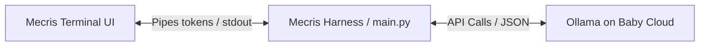

# Sunkworks Episode 84: Mecris Moves to the Moon

This document outlines the agenda, technical architecture, and implementation tasks for **Sunkworks Episode 84**, focusing on remote LLM piping, edge AI adaptation (Halo 10H), and live stream preparation.

## 1. Episode Context & Overview
* **Stream Time**: Today (in ~30 minutes)
* **Theme**: "Mecris Moves to the Moon"
* **Focus**: Showcasing Mecris as open-source prior art for agentic accountability, setting up remote model connections (Ollama), and planning for edge/constrained AI deployment (Halo 10H).
* **Safety Protocol**: Strict zero-leak policy. Ensure local `.env` and private Neon connection strings remain hidden from terminal outputs during the broadcast.

---

## 2. Technical Architecture: Remote Token Piping
The harness needs to bridge local user interaction with remote LLM execution:

### Key Tasks:
1. **Streaming API Integration**:
   - Refactor the response processing in `claude_monitor.py` and `cli/main.py` to stream tokens directly to `stdout`.
   - Provide visual indicators (e.g., active status bar or real-time token count) to eliminate black-box waiting.
2. **Fallback Logic**:
   - Ensure that if the remote Ollama server on the baby cloud is unreachable, the system gracefully falls back to local execution or displays a clear connection error without crashing the TUI.

---

## 3. Edge AI Adaptation: Halo 10H Integration
We need to design a lightweight integration pattern for the **Halo 10H** (Raspberry Pi form factor, low power, restricted memory):

* **The Paradigm**: Inspired by NASA's **Prithvi** Earth observation pipeline (which consumes strictly formatted image data and outputs structured JSON), the Halo 10H will act as a dedicated, single-purpose node.
* **The Pipeline**:
  - Instead of running a general-purpose, high-parameter LLM locally on the edge device, the edge device runs highly specialized, quantized models.
  - Structured JSON outputs from the edge are piped to a coordinate node (or the 600B Mistral cluster) for synthesis.
* **Implementation Goal**: Establish the interface schemas in Mecris to parse and record these structured telemetry outputs.

---

## 4. Live Stream Agenda & Prep Checklist

- [ ] **Step 1: Reload MCP Servers**
  - Execute `/mcp reload` in the Antigravity CLI to force the client to read [.mcp/mecris.json](file:///Users/yebyen/w/mecris/.mcp/mecris.json) and inject the `get_narrator_context` tool into the active session.
- [ ] **Step 2: Start local stdio log tail**
  - Verify that the background coordination engine starts and writes logs to `/tmp/mecris_stdio.log` once the reload is triggered.
- [ ] **Step 3: Secrets Check**
  - Verify that neither [.env](file:///Users/yebyen/w/mecris/.env) nor `~/.gemini/antigravity-cli/mcp_config.json` contain hardcoded passwords or keys.
- [ ] **Step 4: Run the TUI**
  - Verify that the local `mecris pulse` dashboard renders without displaying sensitive tokens or endpoints.
